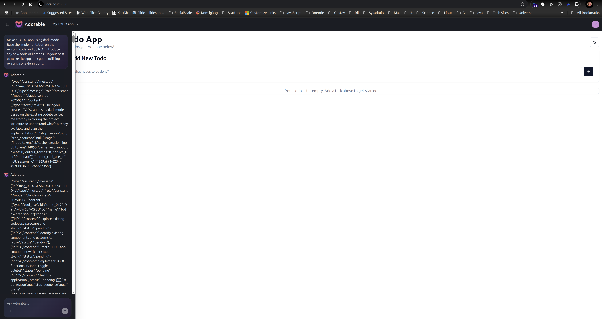
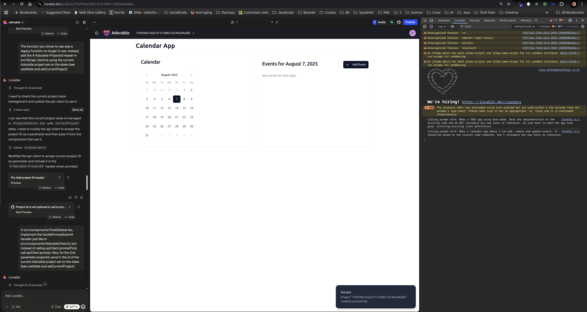
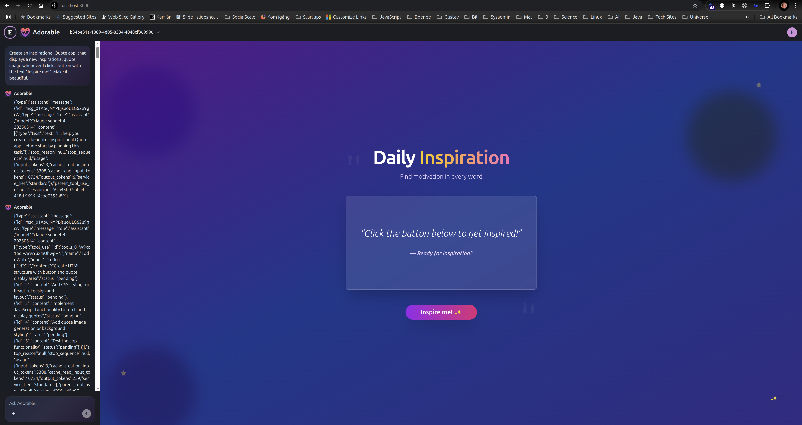
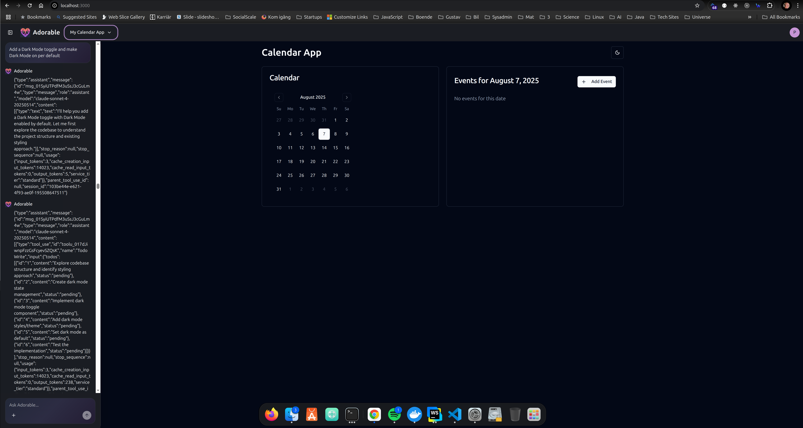
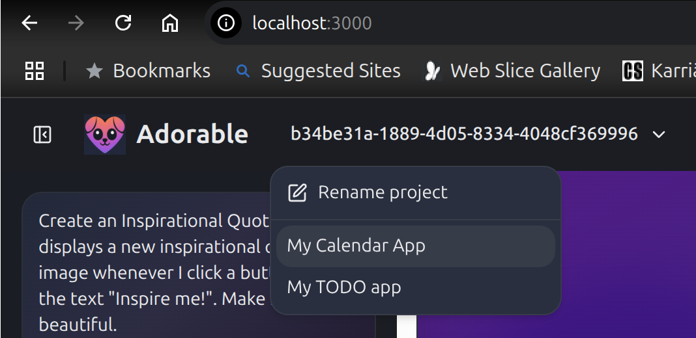

# Adorable - A Lovable Clone

## Overview

Adorable is a Lovable clone written mainly in TypeScript.

## Components 

It consists of the following components:

### The UI

Created largely in Lovable and providing the following features:

* Log in, Sign up and Log out
* Creating, Listing, Selecting/Toggling and Renaming projects
* Prompting - Initial creation (from main page - also creates project) and improvements (from chat sidebar)
* Per-project chat history - Displayed in togglable left sidebar and persisted in Supabase

### The Backend Server (API Server)

Handles/executes prompts and manages project workspaces.

Claude Code SDK is used to programmatically delegate user prompts to claude code and to collect all messages.

A shared disk volume defined in Docker Compose and rsync are used to set up new project workspaces from 
scaffolding code and to sync current project workspaces to the current workspace (as run by the dev server). 
Generated code is thereby persisted on disk in directories named by the respective project id.

### The Dev Server

Running the current project code (from the current workspace directory) as managed by the backend server.

### Supabase

Supabase handles authentication and database table storage/access.

Servers access Supabase using the Supabase publishable key as well as the user's JWT token.

### Docker / Docker Compose - Deployment and Shared Disk Volume

The servers are deployed in Docker and orchestrated using Docker Compose.

A shared disk volume is used to allow for the backend server to more easily manage the current contents of the dev server.

## Considerations and Limitations

Here follows a list of considerations and limitations in no particular order:

### Single-User Only

The current setup is only for local, one user scenarios. In particular, the backend- and dev server assumes there is 
always just one (1) active workspace/project. Perhaps for an app like this - that creates and manages other apps and 
all its files - it might not be as easy to achieve multi-tenancy as in more classic server applications, but still.

### Claud Code Doing All The Heavy Lifting

Arguably, Adorable is a Lovable wrapper on top of Claude Code. It was basically the only feasible way of getting 
something functional up so quickly, but a real implementation would probably have:
* A comprehensive, customized and tuned system prompt
* Specific tool usage
* Selecting different LLMs depending on the case at hand
* Custom logic and workflows
* Etc.

### Missing GitHub Integration

It would be desirable to have, like in Lovable, the user connect their apps to GitHub and be able to push the generated 
code changes there. It could possibly also have been a way to achieve more autonomy between backend- and dev servers - 
i.e. to avoid the shared volumes and (in practice) the co-located deployment of the servers. That said, GitHub
integration is probably more for the benefit of users being able to collaborate with AI:s rather than being the 
fundamental sync mechanism. 

### Deployment of Created Apps

No deployment of created apps is (yet) implemented, which is arguably a very important feature.

### TODO

There are definitely more considerations and limitations, but I am getting too tired to write more at the moment. 
I will continue writing tomorrow or upon request.

Also, I really want to clean up the code. I just managed to finish implementing the needed functionality in time. 
Just to state that the current code quality is NOT representative of my normal work, but rather that sometimes one 
has to make hard priorities and cut some corners (at least temporarily) to get through the gates in time.

## Screenshots

Below are some screenshots from running the app.

### Multiple Apps 

Multiple apps created and managed in parallel (+ sidebar with project-/app-specific chat history)

Improve an app (consecutive prompts)

Rename a project 

